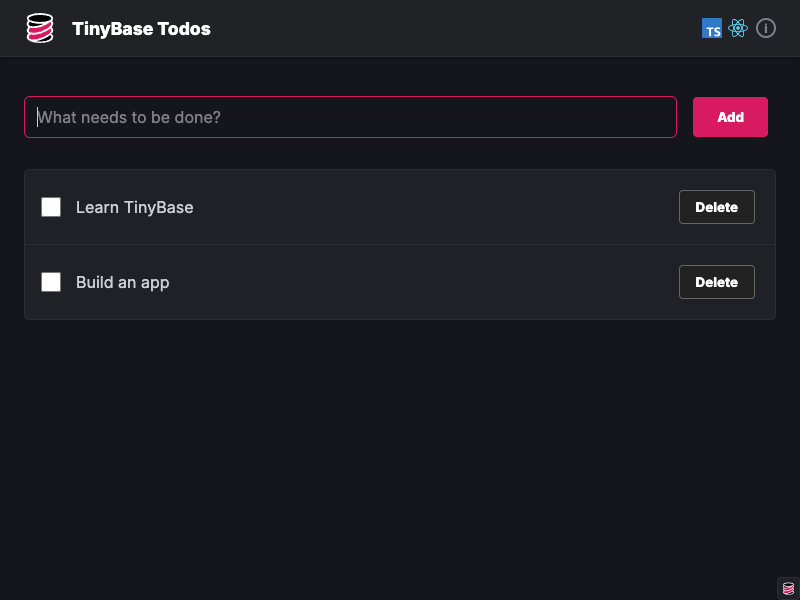
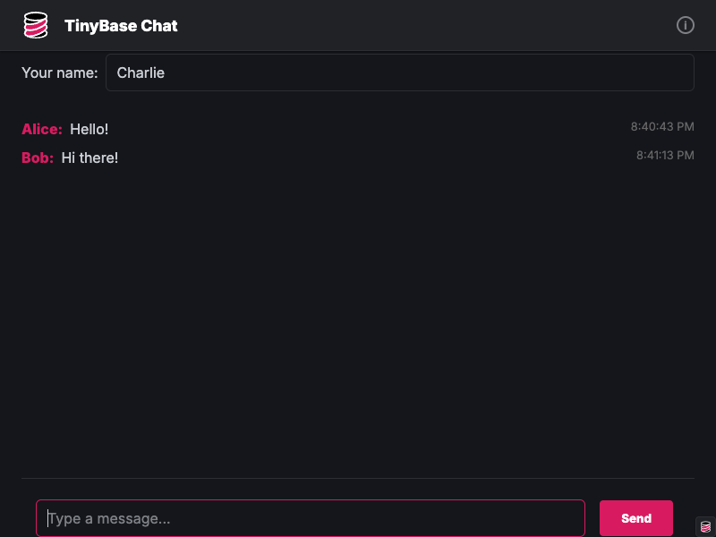
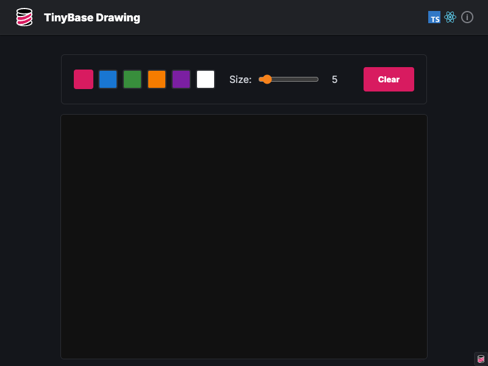
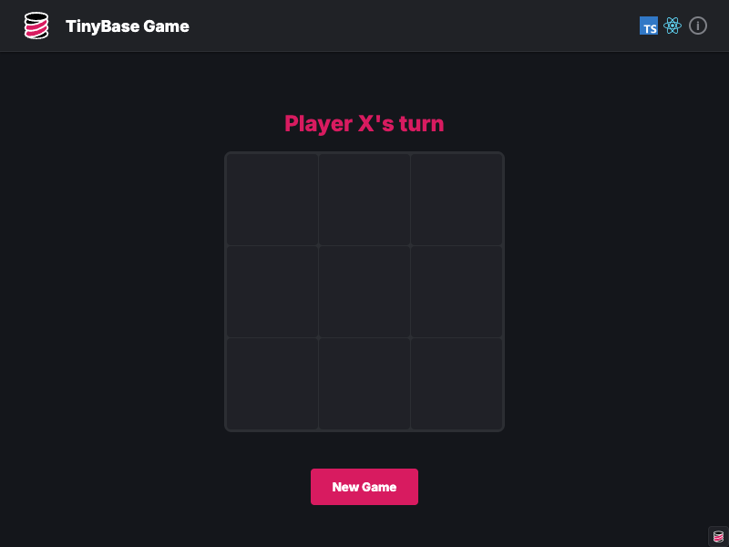

# create-tinybase

A CLI tool to scaffold a new TinyBase application with full synchronization and
local-first capabilities.

Build a todo list, a drawing app, a chat app, or a tic-tac-toe game using
TypeScript or JavaScript, with React or Vanilla JS - in just a matter of
seconds.

## Usage

```bash
npm create tinybase@latest
```

(PNPM, Yarn, and Bun should also work!)

This will prompt you with questions to configure your new TinyBase app:

- **Project name** - Name of your project directory
- **Language** - TypeScript or JavaScript
- **Framework** - React or Vanilla JS
- **App type** - Todo app, Chat app, Drawing app, or Tic-tac-toe game
- **Store schemas** - TypeScript type safety for stores (TypeScript only)
- **Synchronization** - None, remote demo server, local Node server, or local Durable Objects server
- **Persistence** - None, Local Storage, SQLite, or PGLite
- **Prettier** - Include Prettier for code formatting
- **ESLint** - Include ESLint for code linting

After creating your project:

```bash
cd my-tinybase-app/client
npm install
npm run dev
```

Your app will be available at `http://localhost:5173`, or whichever port Vite
specifies in the console.

If you included server code, start the server in a separate terminal:

```bash
# In a separate terminal
cd my-tinybase-app/server
npm install
npm run dev
```

Your app should look something like this:

### Todo App



- Task list with add/complete/delete
- Single store for todos
- Demonstrates basic CRUD operations
- Perfect starter example

### Chat App



- Multi-user messaging interface
- Dual stores: settings + messages
- Username configuration
- Real-time message sync

### Drawing App



- Collaborative drawing canvas
- Brush size and color controls
- Dual stores: settings + canvas
- Optimized point-based stroke storage

### Tic-tac-toe Game



- Two-player game board
- Win/draw detection
- Turn management
- Game state synchronization

## Configuration Options

During the prompts, you can customize various aspects of your TinyBase app. Here
are the details of what each option entails:

### Language Choice

**TypeScript** provides full type safety with:

- Typed store schemas (optional)
- IntelliSense support for TinyBase APIs
- Compile-time error checking
- Better IDE integration

**JavaScript** offers:

- Faster setup with no transpilation step
- Simpler learning curve
- Still fully functional with TinyBase

### Framework Choice

**React** provides:

- Component-based architecture
- React hooks for TinyBase stores
- Automatic re-rendering on store updates
- Full ecosystem support

**Vanilla JS** offers:

- No framework dependencies
- Smaller bundle size
- Direct DOM manipulation
- Manual listener-based updates

### App Types

- **Todo App** - Simple task management with add, edit, delete features
- **Chat App** - Real-time messaging between multiple clients
- **Drawing App** - Collaborative canvas with basic drawing tools
- **Tic-Tac-Toe Game** - Two-player game with real-time updates

### Store Schemas (TypeScript Only)

When enabled, schemas provide:

- Full TypeScript typing for store structure
- Runtime validation
- Better autocomplete
- Type-safe data access

Schemas define:

- Table structures with cell types
- Value types
- Default values
- Strict typing for all store operations

### Synchronization

Choose from four synchronization options:

**None**:

- Local-only data storage
- No network dependencies
- Simpler architecture
- Still uses MergeableStore for consistency

**Via remote demo server (stateless)** (default):

- Real-time sync between browser tabs
- WebSocket-based synchronization
- Connects to demo server (wss://vite.tinybase.org)
- MergeableStore for conflict-free replication
- Automatic reconnection handling
- Great for prototyping
- No local server management needed

**Via local node server (stateless)** (port 8043):

- Real-time sync with local Node.js server
- WebSocket server using `ws` library
- TinyBase server synchronizer
- Runs with `npm run dev` in server directory
- Stateless - no data persistence
- Easy to deploy to any Node.js host
- Full control over server code

**Via local DurableObjects server (stateful)** (port 8787):

- Real-time sync with Cloudflare Durable Objects
- Serverless WebSocket server
- Edge computing with Durable Objects
- Stateful - data persists in Durable Objects storage
- Global distribution
- Runs locally with Wrangler
- Designed for production deployment

### Persistence

Choose how to persist store data on the client:

**None**:

- No client-side persistence
- Data lost on page refresh
- Simplest option for demos
- Still works with synchronization

**Local Storage** (default):

- Browser localStorage persistence
- Data persists across sessions
- Simple and widely supported
- Automatic load/save with `createLocalPersister`
- Best for most use cases

**SQLite**:

- Browser-based SQLite via WebAssembly
- Structured database storage
- Uses `@sqlite.org/sqlite-wasm` package
- IndexedDB-backed (`:local:` prefix)
- Good for complex data structures
- Slightly larger bundle size

**PGLite**:

- PostgreSQL in the browser
- Full PostgreSQL compatibility
- Uses `@electric-sql/pglite` package
- IndexedDB-backed (`idb://` prefix)
- Advanced SQL features
- Larger bundle size

**Important Notes:**

- Persistence is configured **before** synchronization to avoid race conditions
- Works with all sync types (or no sync)
- In multi-store apps, all stores get persistence
- Data is automatically loaded on app start and saved on changes

### Prettier & ESLint

**Prettier**:

- Automatic code formatting
- Consistent style across project
- Pre-configured settings
- Runs on save (with IDE integration)

**ESLint**:

- Code quality checks
- Catch common errors
- Import organization
- TypeScript-aware rules

## Project Structure

All apps are created with a monorepo structure:

```
my-tinybase-app/
├── package.json         # Root package (manages workspaces)
├── README.md            # Getting started guide
├── client/              # Client application
│   ├── package.json     # Client dependencies
│   ├── index.html       # Entry HTML
│   ├── public/          # Static assets
│   └── src/             # Source code
│       ├── App.tsx      # Main app component
│       ├── Store.tsx    # TinyBase store setup
│       └── ...          # App-specific components
└── server/              # Server code (optional)
    ├── package.json     # Server dependencies
    └── src/
        └── index.ts     # Server entry point
```

## Learn More

- [TinyBase Documentation](https://tinybase.org)
- [TinyBase GitHub](https://github.com/tinyplex/tinybase)
- [Synchronization Guide](https://tinybase.org/guides/synchronization)
- [React Integration](https://tinybase.org/guides/building-uis/using-react)

## License

MIT License - see
[LICENSE](https://github.com/tinyplex/tinybase/blob/main/LICENSE) file for
details.
